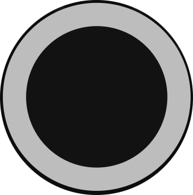

import PythonApi from './_button-api-python.jsx';
import RustApi from "./_button-api-rust.mdx";

The click button is the most simple button available. User tap down, button do its job.
Click once to send an empty event.

## Thumbnail

## API

| Trigger | Value |
| --- | --- |
| OnTapDown | `ClickButton {}` |

### Example

import TabItem from '@theme/TabItem';
import Tabs from '@theme/Tabs';

<Tabs>
  <TabItem value="python" label="Python" default>
    <PythonApi name="ClickButton" id="1"/>
  </TabItem>
  <TabItem value="rust" label="Rust">
    <RustApi name="ClickButton" id="1"/>
  </TabItem>
</Tabs>

## Datasheet

| Property | Value |
| --- | --- |
 | Size | 2x1 |
 | Behavior | `user_trigger` |

(*) : arbitrary unit representing a reasonable digit dimension on the screen
