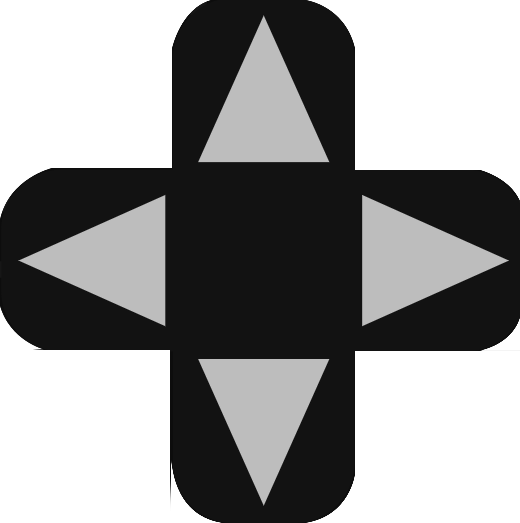

import PythonApi from './_button-api-python.jsx';
import RustApi from './_button-api-rust.mdx'; 

The directional button is composed of 4 `PressButton`, one for each direction. 
When none directions are pressed, the direction `null` is called.

## Thumbnail

!

## API

| Trigger | Value |
| --- | --- |
| OnTapDown(`u8`) | `DirectionalButton {direction: u8}` |
| OnTapUp() | `DirectionalButton {pressed: 0}` |

### Example

import Tabs from '@theme/Tabs';
import TabItem from '@theme/TabItem';

<Tabs>
  <TabItem value="python" label="Python" default>
    <PythonApi name="DirectionalButton" id="1"/> 
  </TabItem>
  <TabItem value="rust" label="Rust">
     <RustApi name="DirectionalButton" id="1"/> 
  </TabItem>
</Tabs>
-->

## Datasheet

| Property | Value |
| --- | --- |
 | Size | 4x4 |
 | Behavior | `user_trigger` |

(*) : arbitrary unit representing a reasonable digit dimension on the screen
