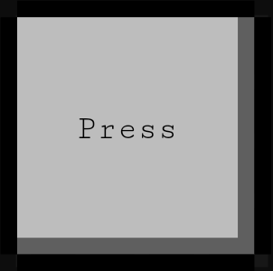

import PythonApi from './_button-api-python.jsx';
import RustApi from './_button-api-rust.mdx';

The click button is the most simple button available. User tap down, button do its job.
Press once to send an empty event.

## Thumbnail

## API

| Trigger | Value |
| --- | --- |
| OnTapDown | `PressButton {pressed: true}` |
| OnTapUp | `PressButton {pressed: false}` |

### Example

import Tabs from '@theme/Tabs';
import TabItem from '@theme/TabItem';

<Tabs>
  <TabItem value="python" label="Python" default>
    <PythonApi name="PressButton" id="1"/>
  </TabItem>
  <TabItem value="rust" label="Rust">
    <RustApi name="PressButton" id="1"/>
  </TabItem>
</Tabs>

## Datasheet

| Property | Value |
| --- | --- |
 | Size | 1x1 |
 | Behavior | `user_trigger` |

(*) : arbitrary unit representing a reasonable digit dimension on the screen
